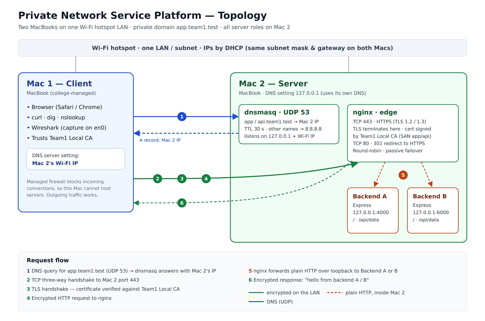

# Private Network Service Platform

A fully local private service network built on two macOS laptops for our **Computer Networks** course project. There is no cloud and no pre-configured server: DNS, the load balancer, HTTPS and the backends are all set up by hand on our own machines.

> **Core principle:** the application stays simple, the network is the project.



## What it does

From the client Mac, opening **`https://app.team1.test`**:

1. **Resolves** the private name through our own DNS server (dnsmasq)
2. **Connects** over TCP to our nginx edge server
3. **Negotiates TLS** with a certificate signed by our own local CA (no browser warning)
4. **Load-balances** the request across two backend servers (round-robin)
5. **Returns** `hello from backend A` or `hello from backend B`

Every step is captured and explained with Wireshark, `dig`, `curl` and browser DevTools.

## Setup

| Machine | Role | Runs | Ports |
|---|---|---|---|
| **Mac 1** | Client | Browser, curl, dig, Wireshark | — |
| **Mac 2** | Server | dnsmasq · nginx · Backend A · Backend B | 53/UDP · 443, 80/TCP · 4000 · 6000 |

Mac 1 is a college-managed laptop whose firewall blocks incoming connections, so all server roles run on Mac 2. See [docs/architecture.md](docs/architecture.md#why-all-server-roles-are-on-mac-2) for how we diagnosed this.

## Tech stack

- **DNS:** dnsmasq, private `.test` domain (`app.team1.test`, `api.team1.test`)
- **Edge:** nginx: reverse proxy, round-robin load balancing, passive failover, TLS termination
- **TLS:** OpenSSL, self-generated local CA with SAN certificate
- **Backends:** Node.js + Express
- **Analysis:** Wireshark, tcpdump, `dig`, `curl`, browser DevTools

## Repository structure

```
CN_Project/
├── backendA/                 Express server, port 4000
├── backendB/                 Express server, port 6000
├── configs/
│   ├── dnsmasq/dnsmasq.conf  Private DNS records and forwarders
│   └── nginx/team1.conf      HTTPS, load balancer, redirect
├── certs/                    Public CA + server certificate, SAN config (private keys are git-ignored)
├── docs/
│   ├── architecture.md       Roles, ports, request flow by layer, design decisions
│   └── topology.png
└── evidence/phase1/
    ├── A-network/            IP / subnet / gateway / MAC, ping both ways
    ├── B-dns/                dnsmasq config, dig & nslookup from the client, query log
    ├── C-backends/           Both backends running
    ├── D-loadbalancer/       nginx config, round-robin A/B
    ├── E-https/              Certificate, curl -v verify ok, browser padlock, redirect
    ├── F-caching/            Cache-Control, ETag, 304, browser cache behaviour
    ├── G-wireshark/          Full DNS → TCP → TLS → HTTP capture (.pcapng + screenshots)
    └── failures/             Five failure demos + failures.md
```

## Running it (on Mac 2)

**Prerequisites:** Homebrew, Node.js, `brew install dnsmasq nginx openssl@3`

1. **Backends:** in two terminals:
   ```bash
   cd backendA && npm install && npm start      # port 4000
   cd backendB && npm install && npm start      # port 6000
   ```
2. **DNS:** copy `configs/dnsmasq/dnsmasq.conf` to `/opt/homebrew/etc/dnsmasq.conf`, replace the IP with Mac 2's current Wi-Fi IP (`ipconfig getifaddr en0`), then:
   ```bash
   sudo brew services start dnsmasq
   sudo networksetup -setdnsservers Wi-Fi 127.0.0.1
   ```
3. **Certificates:** generate the CA and server certificate (commands in [certs/make-certs.md](certs/make-certs.md)), copy the `.crt` and `.key` to `/opt/homebrew/etc/nginx/certs/`.
4. **nginx:** copy `configs/nginx/team1.conf` to `/opt/homebrew/etc/nginx/servers/`, then:
   ```bash
   sudo nginx -t && sudo nginx
   ```

**On Mac 1 (client):**
```bash
sudo networksetup -setdnsservers Wi-Fi <Mac 2 IP>
sudo security add-trusted-cert -d -r trustRoot -k /Library/Keychains/System.keychain ca.crt
curl -v https://app.team1.test
```

When finished, restore normal DNS on both Macs: `sudo networksetup -setdnsservers Wi-Fi empty`.

## Endpoints

| Path | Response | Caching |
|---|---|---|
| `GET /` | `hello from backend A` / `B` | — |
| `GET /api/data` | `{"items": ["alpha", "beta", "gamma"]}` | `Cache-Control: max-age=60`, ETag, 304 support |

## Project phases

- **Phase 1 – Build & Observe** ✅ LAN, private DNS, backends, nginx load balancing, HTTPS, HTTP caching, packet-capture evidence, failure demos.
- **Phase 2 – Harden & Recover:** backup DNS, TTL behaviour, backend firewall isolation, failover, DNS-based edge cutover, troubleshooting.

## Team

| Member | Machine | Responsibilities |
|---|---|---|
| Yatin Singh | Mac 2 (server) | DNS, nginx, TLS, backends |
| Dadi Dinesh | Mac 1 (client) | Client setup, Wireshark capture, testing |
